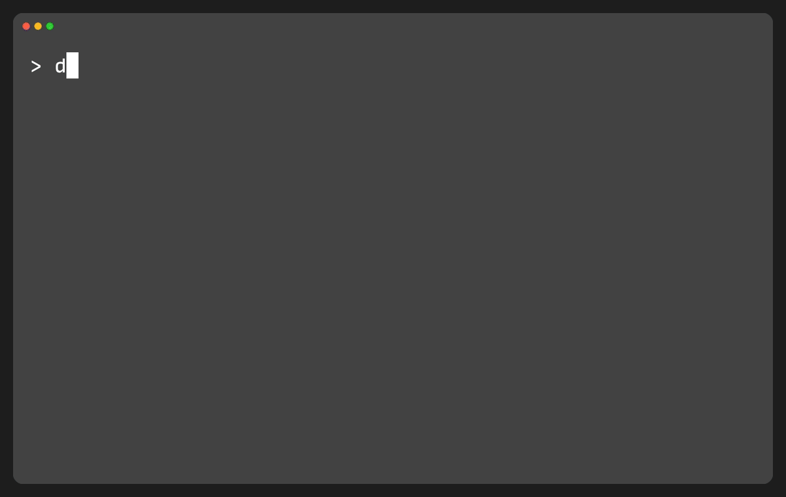
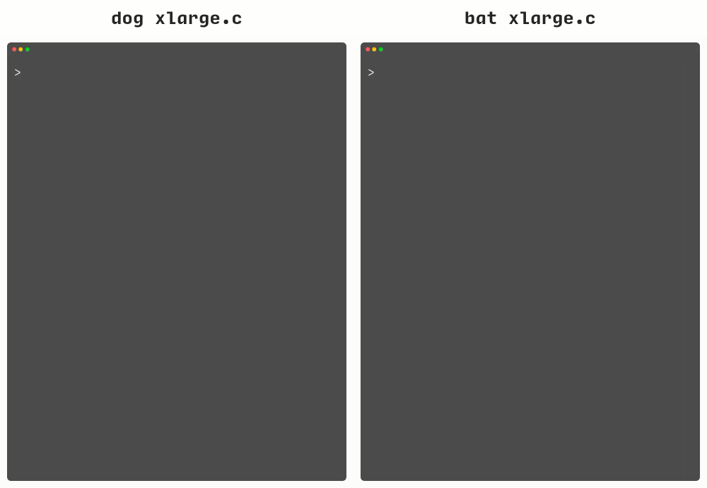

# <sub><picture><source media="(prefers-color-scheme: dark)" srcset="assets/dog-dark.svg"></picture></sub> dog

> Faster than bat cli, with better theming. (written in swift, powered by tree-sitter, btw)



*Themes: UtilityDark (default), [Catppuccin Frappé](https://zed-themes.com/themes/catppuccin?name=Catppuccin%20Frapp%C3%A9), [Vim Adwaita Dark](https://zed-themes.com/themes/vim-theme?name=Vim%20Adwaita%20Dark), [Tokyo Night](https://zed-themes.com/themes/tokyo-night?name=Tokyo%20Night), built-in [`--light`](https://sh.dog/configuration#light).*

A `cat` alternative for macOS and Linux that prints files to your terminal with syntax highlighting — backgrounds, line numbers, and gutter included. Auto-pages with `less`. Starts up in ~5ms, so it's great piped into previewers like `fzf`, `tv`, and `yazi`.

```sh
# dog responds instantly when you call them
dog Sources/dog/Dog.swift

# dog can brighten up your day
dog --light src/lib.rs

# You can pass dog a bone
echo 'struct Point { let x, y: Int }' | dog -l swift

# dog remembers your favorite theme
dog --set-default-theme 'Nord Dark'

# dog plays well with other pets
fzf --preview 'dog --color=always --theme "Catppuccin Mocha" {}'
```

A [yazi plugin](https://github.com/edden27/dog.yazi) wraps `dog` as a previewer with caching and theme config.


## Why dog

- **[800+ Zed themes](https://sh.dog/how-to-use-themes#finding-editing-or-creating-themes)** — drop a JSON file in, or point `--theme-dir` at your existing `~/.config/zed/themes` and use what you already have. Backgrounds, line numbers, and gutter are all theme-controlled, opacity included. Two zero-cost built-ins ship too — dark is the default, `--light` flips to the bright one. Any theme can be [saved as your default](https://sh.dog/how-to-use-themes#set-a-default-theme) — stored precomputed, so it loads as fast as the built-ins.
- **Up to 14.6× faster than bat on large files** — 54k lines of TypeScript in 0.4s vs 5.8s. 100% syntax coverage across all [17 supported languages](#supported-languages).
- **~5ms startup, every language** — precompiled highlight queries mean there's no per-language warmup. In fzf or yazi, that's the latency on every keystroke.
- **Single binary, no runtime deps** — [17 grammars](#supported-languages) statically compiled in. Copy it anywhere, it runs.
- **Built on tree-sitter** — full AST parse, not regex. Highlight queries from [nvim-treesitter](https://github.com/nvim-treesitter/nvim-treesitter).
- **Written in Swift** — direct tree-sitter C API. Custom ANSI renderer, custom zero-copy JSON parser (sub-millisecond theme loads).


## Supported languages

| Language | Speed vs bat, large files |
| :--- | ---: |
| Bash | 6.1× |
| C | 5.8× |
| C++ | 7.7× |
| CSS | 6.4× |
| Go | 6.7× |
| HTML | 1.7× |
| JavaScript | 10.1× |
| JSON | 9.1× |
| Lua | 5.2× |
| Markdown | 7.7× |
| Python | 6.1× |
| Ruby | 5.2× |
| Rust | 6.8× |
| Swift | 5.3× |
| TSX | 11.9× |
| TypeScript | 14.6× |
| YAML | 9.5× |

*HTML's ratio looks tight because its "large" benchmark file is only ~2,400 lines — it benchmarks like a medium file. Full matrix in the [benchmarks](https://sh.dog/benchmarks#speed).*


> [!TIP]
> The language is auto-detected from the file extension, filename, or shebang — force one with `-l <language>`. `dog --list-languages` prints the names to use.


## Install

**Install script** — picks the right build for your machine, installs it, and sets up shell completions:

```sh
curl -fsSL https://sh.dog/install | sh
```

**Homebrew**:

```sh
brew tap edden27/dog
brew trust edden27/dog
brew install dog
```

**Binary** — four builds: `dog-macos-arm64`, `dog-macos-x86_64`, `dog-linux-x86_64`, `dog-linux-arm64`. Grab yours:

```sh
curl -L https://github.com/edden27/dog/releases/latest/download/dog-macos-arm64.tar.gz | tar xz
sudo mv dog /usr/local/bin/
```

**From source** — needs Swift 6.3 or newer (Xcode 26 on macOS):

```sh
git clone https://github.com/edden27/dog
cd dog
make build && make install
```

`make install` copies the binary into `/usr/local/bin`, asking for sudo only when it has to; `make install PREFIX=~/.local` avoids sudo entirely. Only need a few languages? `dog` can compile a subset — a Swift+JSON-only build is ~5 MB instead of ~20. See [custom builds](https://sh.dog/installation#custom-language-builds).

Requires macOS 14+ or Linux with the Swift runtime (bundled in the Linux binary).

**Tab completions** — dog generates its own completion script for bash, zsh, and fish (`dog --generate-completion-script zsh`); the [docs](https://sh.dog/how-to-integrate-dog#shell-completions) walk through the one-time install for your shell.


## How does it compare to bat?



*Left: `dog` in [1.1s](https://sh.dog/benchmarks#extreme), right: `bat` in [6.9s](https://sh.dog/benchmarks#extreme) — printing the same 260,493-line C file.*

|                                             | dog                      | bat            |
| ------------------------------------------- | ------------------------ | -------------- |
| Engine                                      | tree-sitter, full AST    | regex per line |
| Themes                                      | Zed JSON, 800+ available | TextMate XML   |
| Bold & italic fonts (all 4 styles)          | Theme-controlled         | Partial — italics opt-in, never combined |
| Line background, gutter, line-number colors | Theme-controlled         | Fixed          |
| Languages                                   | [17](#supported-languages) | 200+           |
| Syntax coverage (avg)                       | **100%**                 | 77%            |
| Multi-file, git gutter, Windows             | Not yet                  | Yes            |
| Binary size                                 | ~20 MB (macOS)           | ~5 MB          |


Full benchmarks and methodology in the [docs](https://sh.dog/benchmarks).


## Documentation

- **[Getting started](https://sh.dog/getting-started)** — install, [your first highlight](https://sh.dog/getting-started#first-highlight), [changing themes](https://sh.dog/getting-started#change-themes), and [dog as a file previewer](https://sh.dog/getting-started#use-dog-as-a-file-previewer)
- **[Installation](https://sh.dog/installation)** — every install method, plus [no-sudo installs](https://sh.dog/installation#install-location) and [custom language builds](https://sh.dog/installation#custom-language-builds)
- **[Configuration](https://sh.dog/configuration)** — every flag, env var, exit code
- **[How to integrate dog](https://sh.dog/how-to-integrate-dog)** — recipes for [fzf](https://sh.dog/how-to-integrate-dog#fzf), [tv](https://sh.dog/how-to-integrate-dog#tv), and [yazi](https://sh.dog/how-to-integrate-dog#yazi) previews, [tab completions](https://sh.dog/how-to-integrate-dog#shell-completions), and advanced commands for pagers, pipes, and stdin
- **[Theming](https://sh.dog/how-to-use-themes)** — [setting a default theme](https://sh.dog/how-to-use-themes#set-a-default-theme), [using existing Zed themes](https://sh.dog/how-to-use-themes#using-existing-zed-themes), [finding themes](https://sh.dog/how-to-use-themes#finding-editing-or-creating-themes), [creating your own themes](https://sh.dog/how-to-use-themes#writing-a-custom-theme), [full token list](https://sh.dog/how-to-use-themes#supported-tokens)
- **[Benchmarks](https://sh.dog/benchmarks)** — full [speed](https://sh.dog/benchmarks#speed) and [coverage](https://sh.dog/benchmarks#coverage) matrix, the [methods](https://sh.dog/benchmarks#conditions) behind the numbers, and [how to run them yourself](https://sh.dog/benchmarks#reproduce)
- **[How is dog different?](https://sh.dog/how-is-dog-different)** — how dog is built, what that changes for themes, coverage, and speed, and when to use which


## Status

`0.1.0` — first public release. `dog` is stable at 0.1 but still a puppy: we don't anticipate breaking changes, but it is in active development. Known limitations:

- Single file at a time (multi-file planned)
- No git-diff gutter
- No Windows
- `--range`, `--header`, and `--no-line-numbers` are stubs
- `$PAGER` not honored (pager is hardcoded to `less -R`)

Most likely next — no promises, no order: line ranges, line highlighting, headers/footers, TOML config, more languages, alternative pagers, git integration, `man` + `--help` highlighting. See [What's next](https://sh.dog/how-is-dog-different#what-s-next).

Test suite: 222 Swift unit tests across 31 suites + 51 integration assertions across 9 suites + 13 bat-compatibility scenarios.


## Acknowledgements

- Highlight queries from [nvim-treesitter](https://github.com/nvim-treesitter/nvim-treesitter) (Apache 2.0)
- Tree-sitter grammars from the upstream tree-sitter community
- Theme format from [Zed](https://zed.dev)
- Terminal recordings made with [vhs](https://github.com/charmbracelet/vhs) by Charm


---

> [!TIP]
> **🐕 Dog Fact** — Dogs love dark mode. They have superior night vision and motion detection, which was more important evolutionarily than color vision for their survival as hunters.


## License

MIT — see [LICENSE](LICENSE).